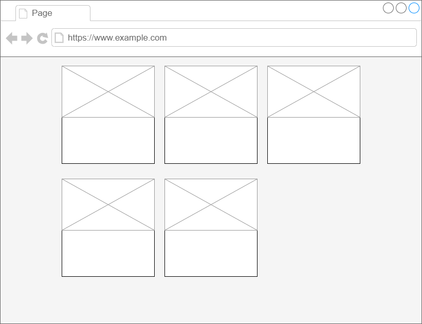

# CSS Help

## Problem
Your coworker has come to you with a problem.  They have most of their project complete but are unable to figure out the last bit of css.  All of the cards needs to form into rows of three columns. They know you are the right person for the job.  You can get it to look right -- or at least close to right. They hand you a crude mock-up of what they are looking for.

## Where to Begin
Begin by examing the `index.html` file and opening it in a browser.  Compare the page's current layout to that of the provided mock-up and make it resemble the mockup.

Feel free to edit:
* `index.html`
* `index.js`
* `index.css`

## Requirements
* Page must resemble mock-up